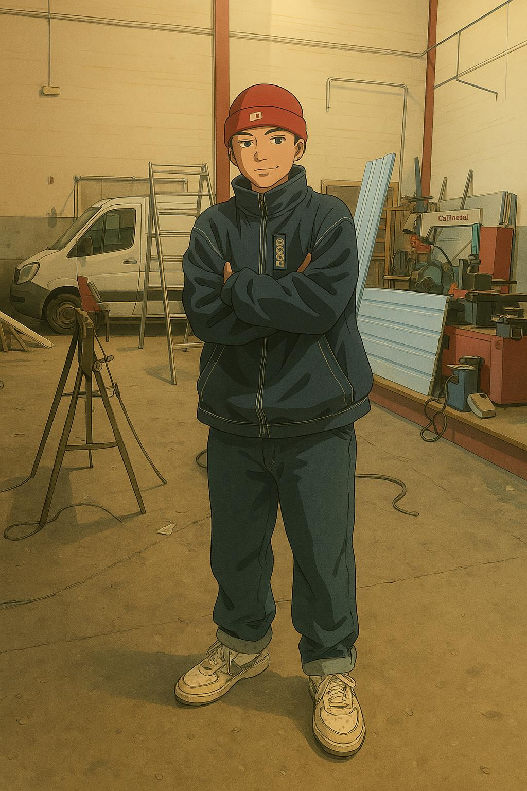

# 💼 Portfolio Web - Mark Antoni Iza Montatixe

¡Bienvenido a mi portfolio personal!  
Aquí encontrarás una presentación profesional de mi perfil como **Desarrollador de Aplicaciones Multiplataforma**, incluyendo mi experiencia laboral, proyectos destacados y formas de contacto.

## ✨ Vista previa


📍 Puedes verlo online aquí: https://mark-iza.github.io/markiza.github.io/

---

## 🧠 Tecnologías usadas

- **HTML5**
- **CSS3** con diseño responsive
- **Font Awesome** para iconos
- **Google Fonts** (Fira Mono, Source Code Pro)
- Efectos con `:hover`, `box-shadow` y animaciones CSS
- Imágenes optimizadas y estructura modular

---

## 📁 Estructura del proyecto

📁 portfolio-mark-antoni/
│
├── index.html # Página principal
├── css/
│ └── style.css # Estilos personalizados
├── img/
│ └── fotoperfil.jpeg # Imagen de perfil
│ └── simpleinformatica.png
│ └── CiclosCorredor.png
└── mi-portfolio.md # 
---

## 🧾 Secciones destacadas

- **Sobre mí:** Breve presentación personal y objetivos profesionales.
- **Experiencia laboral:** Descripción detallada de empleos anteriores.
- **Proyectos:** Incluye mi proyecto destacado **DEKU FIT**, una app de gimnasio personalizada.
- **Contacto:** Enlaces a mi email y perfil de LinkedIn.

---

## 🚀 Cómo verlo localmente

1. Clona el repositorio:
   ```bash
   git clone https://github.com/tuusuario/portfolio-mark-antoni.git
